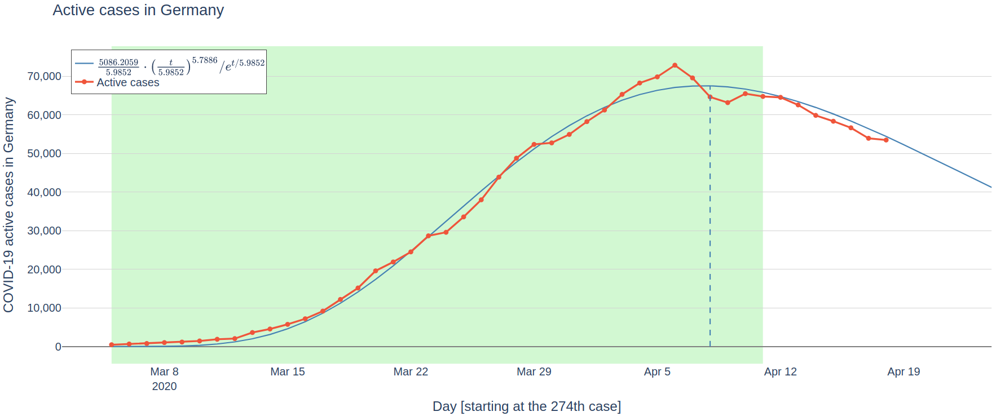
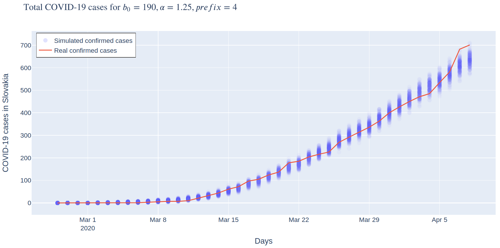

# COVID-19 prediction graphs and simulation of the initial phase in Slovakia

This repository has two main parts, prediction graphs and simulation of the initial phase of the epidemic in Slovakia.

# Prediction graphs

The graphs show [COVID-19 predictions by mathematicians Katarína Boďová and Richard Kollár](https://graphs.lukipuki.sk/covid19/normal/). This part is in the [python directory](./python) and has its own [README](./python/README.md).

# Simulation of the initial phase in Slovakia

The simulation is for the initial phase of the epidemic in Slovakia, based on [Stochastic Simulation of the Initial Phase of the COVID-19 Epidemic in Slovakia](http://www.iam.fmph.uniba.sk/ospm/Harman/COR01.pdf) by the statistician Radoslav Harman.

This part is in the [simulation directory](./simulation) and has its own [README](./simulation/README.md), though some visualization tools for the simulation also sit in the [python](./python) directory.

